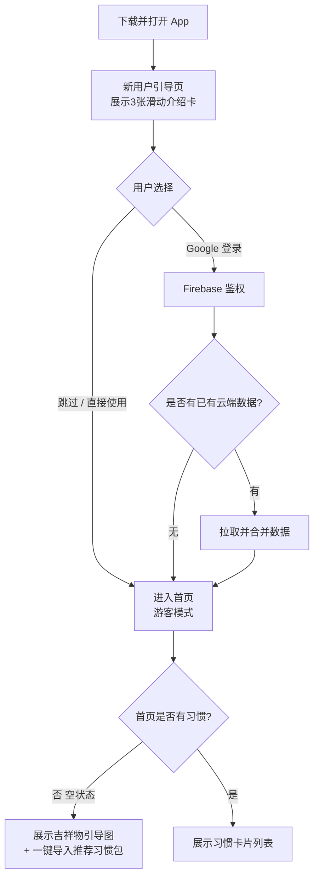
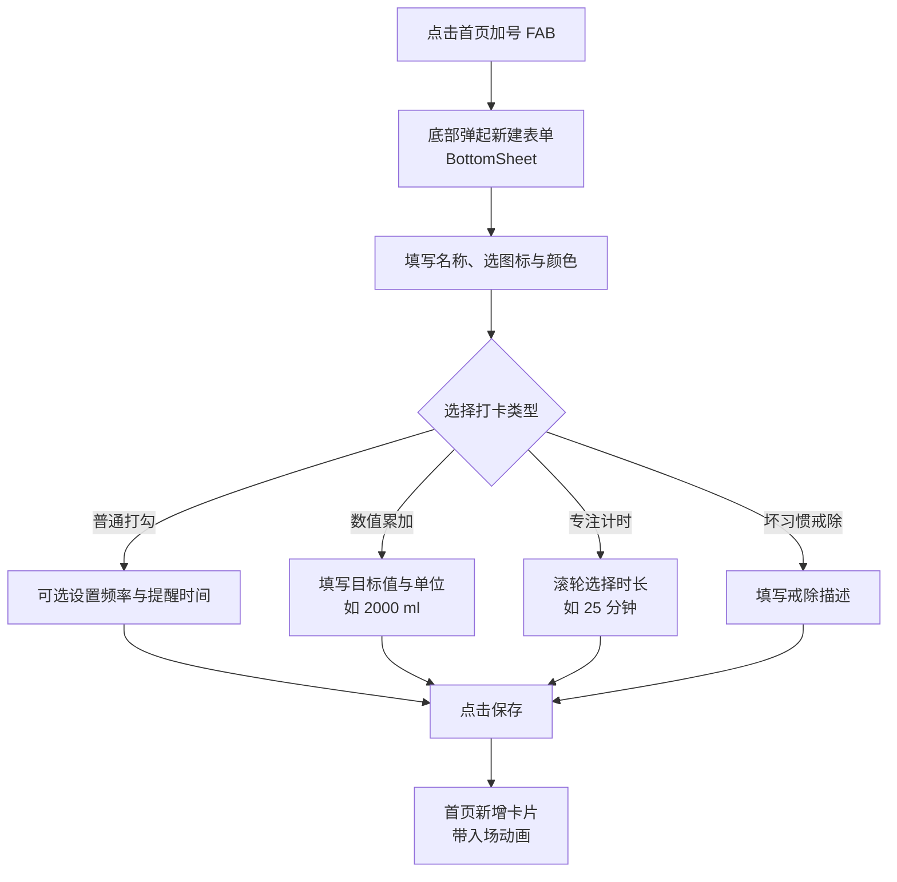
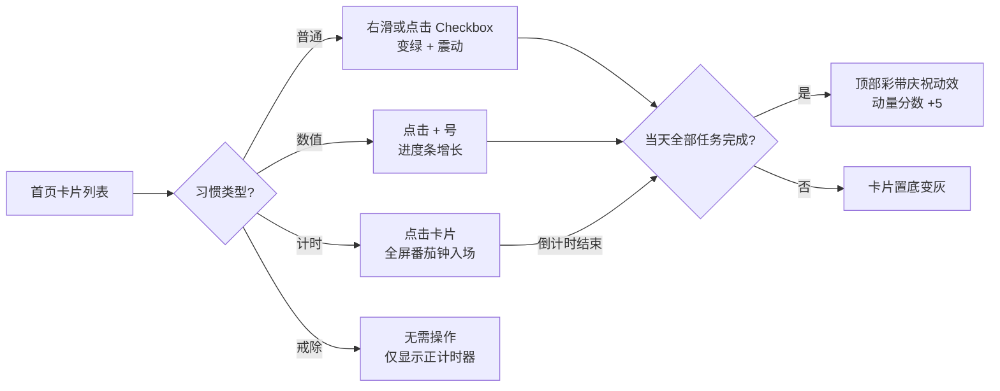
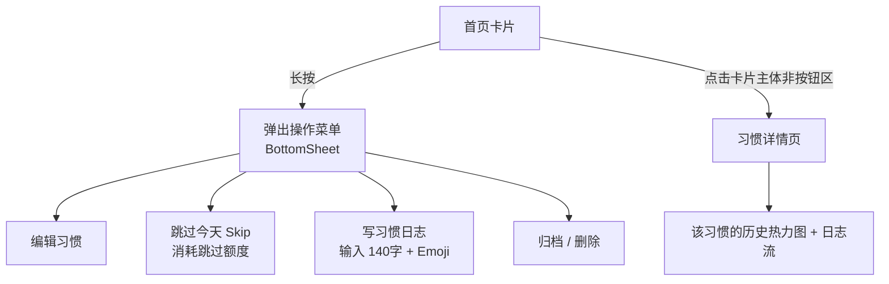

# GoTime 习惯养成 - 核心产品设计与需求总文档 (PRD)

> **修订说明**：本版完全从**大厂高级产品经理 (Senior PM)** 的视角进行了严苛重构。在保留原本 22 项功能一一对应的基础上，加入了【核心价值定位】、【功能优先级 (P0/P1) 划分】以及研发必备的【异常场景处理规则】。本文档为项目唯一的 Single Source of Truth。

---

## 零、 产品战略与核心定位 (Product Strategy)
*   **一句话定位**：一款带有“请假机制”、关注用户心理健康、绝不制造焦虑的极简习惯养成工具。
*   **核心痛点解决**：市面上的打卡 App 断签一天就清零，挫败感极强。GoTime 通过“动量分数”和“冻结跳过”机制，允许合法喘息。
*   **多语言战略 (中/英双语)**：全面支持中文 (简体/繁体) 与英文 (English)。默认跟随手机系统语言。考虑到英文文本通常比中文长 30%，所有的前端 UI 控件（如按钮、卡片）严禁写死固定宽度，必须采用弹性布局 (Flexible Box) 防溢出。
*   **核心北极星指标**：次日留存率、第七日留存率、平均单日完成习惯数。

---

## 一、 App 全局架构与布局 (Wireframe Blueprint)
*通过物理空间的隔离，确保首页极简，把复杂功能向后放。*

```text
=========================================
【Tab 1：今日】(聚焦高频行动)
=========================================
| [云状态☁️]                   10月6日 | 
| ------------------------------------- |
| "习惯不是枷锁，而是通向自由的阶梯"    | <- P1: 每日名言卡 (下拉刷新出现)
| ------------------------------------- |
|  <  五   六  [日]   一   二  >        | 
| ------------------------------------- |
| 💧 喝水 (2000ml)                [ + ] | <- P0: 数值累加打卡
| [████████░░░░░░░░░░] ⌚️已同步         | <- P1: 自动打卡同步状态
| ------------------------------------- |
| 🍅 番茄工作法 (25分钟)          [⏱️] | <- P0: 专注计时 (点击全屏)
| ------------------------------------- |
| 📚 睡前阅读                     [✔] | <- P0: 滑动打卡，长按写日志
| ------------------------------------- |
|                 (+)                   | <- 悬浮大加号
=========================================

=========================================
【Tab 2：洞察】(提供长期正向反馈)
=========================================
| [❤️ HRV 压力自测入口 >]               | <- P2: HRV压力测试
| ------------------------------------- |
| [🔥 12天连胜]          [📈 86%达成]   | <- P0: 习惯报表 & 详细统计
| ------------------------------------- |
| 📍 年度热力图 (左右滑动看全年)        | <- P0: 独有年度成功图 & 图表
| 🟩🟩🟩🟩🟩🟩🟩 🟩🟩🟩🟩🟩🟩⬜      | 
| ------------------------------------- |
| 📝 我的习惯日记流 (Timeline)          |
| 10-06 💧：今天喝得肚子胀 😫           | <- P1: 习惯日志展示区
=========================================

=========================================
【Tab 3：圈子 & 我的】(轻社交与低频设置)
=========================================
| [🔗 邀请好友]                         | 
| ------------------------------------- |
| 🏆 每周全勤对决 (本周)                | <- P1: 共享习惯 & 好友比较
| [我] ██████████░░░ (4天)              | 
| [他] █████░░░░░░░░ (2天)              | 
| ------------------------------------- |
| ⚙️ 高级设置                          |
| [语言:跟随系统(中/英)] [云端备份]     | 
| [隐私安全锁] [深色主题]               | <- P0: 中英双语/深色; P1: 锁; P2: 云同步
=========================================
```

---

## 二、 22 项功能清单详细设计与优先级 (Feature Specifications)

作为专业 PM，不能把所有功能一股脑丢给开发。必须划分 **P0 (核心链路，第一期必须上)**、**P1 (进阶体验，第二期上)** 和 **P2 (探索性功能，第三期上)**。

### 🔥 P0 级功能 (核心基石，V1.0 必须交付)
1. **多种类型 (Multiple habit types)**
   * **交互设计**：【普通类】右滑变绿打勾；【数值类】内置进度条，长按 `+` 呼出刻度条；【坏习惯】无打卡按钮，仅显示红色的正计时器（坚持了X天）。
2. **专注计时 (Focus timer)**
   * **交互设计**：点击卡片触发 `Hero` 动效，屏幕变绿进入全屏沉浸模式。
   * **底层逻辑**：需加入后台防杀补偿机制（重进 App 自动根据时间戳扣减时间）。
3. **详细统计 & 丰富图表 & 习惯报表 (Stats & Charts)**
   * **交互设计**：在洞察页顶部，大字号展示连胜天数与本周/月达成率，辅以极简趋势折线图。
4. **独有年度成功图 (Unique yearly success chart)**
   * **交互设计**：仿 GitHub 热力图，手机端支持左右滑动。
   * **逻辑**：完成度 <50% 浅绿，>50% 正常绿，100% 深绿。跳过/请假为灰色。
5. **高效提醒 & 自定义提醒声音 (Reminders)**
   * **交互设计**：在新建习惯的“高级设置”中配置，支持多组时间，支持选择系统铃声。
6. **黑色主题 (Dark theme)**
   * **设计说明**：使用深灰色 `#121212` 作为底色，避免纯黑。薄荷绿在深色下自动降低饱和度，保护视力。

### 🚀 P1 级功能 (深度留存与体验，V2.0 交付)
7. **每日名言卡 (Daily quote card)**
   * **交互设计**：首页顶部磨砂 Banner。点击可生成带二维码的海报拉起微信分享。
8. **习惯日志 (Habit log)**
   * **交互设计**：打卡后长按卡片，弹出半屏面板限 140 字 + Emoji。在洞察页按 Timeline 纵向展示。
9. **共享习惯 & 好友比较 (Shared & Comparison)**
   * **交互设计**：不搞广场。圈子页仅展示邀请来的好友（横向双轨进度条对抗）。
10. **安全锁 (Security lock)**
    * **逻辑**：App 退至后台 > 1 分钟，再切回时强制全屏高斯模糊，需 FaceID/指纹解锁。
11. **推荐习惯 (Recommended habits)**
    * **交互设计**：点击首页新建按钮，不仅能手写，底部还显示“减脂包”、“早睡包”一键导入。
12. **桌面小组件 & 锁屏小组件 (Widgets)**
    * **交互设计**：提供 2x2, 4x2 尺寸的习惯进度查看组件，融入用户系统壁纸。

### 🌟 P2 级功能 (商业化与生态打通，V3.0 交付)
13. **自动打卡 (Auto check-in)**
    * **逻辑**：静默读取 Apple Health / Android Health Connect 步数，达标后自动将进度条填满。
14. **可操作小组件 (Actionable widgets)**
    * **交互设计**：在桌面上直接点击组件即可打卡，局部刷新，不强制拉起主 App。
15. **云端同步/备份 (Cloud sync)**
    * **逻辑**：基于 Firebase。支持游客模式无缝合库至云端，以 `updated_at` 时间戳解决多端冲突。
16. **位置提醒 (Location reminders)**
    * **交互设计**：拖动地图大头针设定“地理围栏 (Geofencing)”，如离开公司 100 米推送打卡通知。
17. **HRV 压力测试 (HRV stress test)**
    * **交互设计**：洞察页独立入口，调用摄像头/闪光灯检测脉搏变异率，生成放松/疲劳状态。

*(注：原清单中部分同义词已合并至上述条目中)*

---

## 三、 全局规则与异常处理 (Edge Cases - 研发避坑指南)

专业的 PRD 必须为研发扫清一切边缘情况的障碍：

1. **时区判定规则 (防跨国 Bug)**
   * 必须以用户**设备当前本地时间的 00:00** 作为一天的起止。不可强制转换成 UTC 处理前端显示。
2. **断网容灾策略 (Offline-First)**
   * 用户在地铁断网打卡，**绝对不允许弹窗报错**。数据立刻存入本地 SQLite 并展示成功动效。待网络恢复后，后台进程静默执行重试同步。
3. **权限申请策略 (防极度反感)**
   * 严禁在首次打开 App 时直接弹窗要“通知权限”和“位置权限”。必须在用户第一次设置“带有时间的习惯”时，才弹出授权框。
4. **防作弊容错机制**
   * 用户如果修改手机系统时间去补昨天的卡，本地予以承认（保护自信心）。但同步到云端时会被打上 `Suspicious` 标签，不计入好友排行榜对决中，做到“既自欺欺人，又不影响他人”。

---

## 四、 完整用户流程图 (User Flow Diagrams)

*UI 设计师必须从这里开始画原型，明确每一个页面的来源与去向。*

### 4.1 冷启动与首次使用流程


### 4.2 新建习惯核心流程


### 4.3 每日打卡核心流程


### 4.4 习惯卡片操作菜单流程


---

## 五、 空状态与边界 UI 规范 (Empty States)

*每一个有数据展示的地方，必须明确"无数据时展示什么"，否则开发会随机处理造成体验烂尾。*

| 页面场景 | 空状态文案与图示 | 引导行动 (CTA) |
| :--- | :--- | :--- |
| **首页 - 没有任何习惯** | 薄荷绿吉祥物 + "从第一个好习惯开始" | `+ 添加习惯` 或 `导入推荐包` |
| **首页 - 某天无任务** | ✅ 插图 + "今天没有任务，好好休息" | 无 CTA |
| **圈子页 - 还没有好友** | 双人插画 + "邀请一个搭子一起监督" | `🔗 生成邀请链接` |
| **洞察页 - 新用户无历史** | 热力图全灰 + "坚持 7 天，你的热力图会亮起" | 无 CTA |
| **习惯日志流 - 无记录** | "打卡后长按卡片，可以留下今天的心情" | 无 CTA |

---

## 六、 核心数据对象与字段定义 (Data Schema)

*开发工程师据此设计数据库，UI 设计师据此确认每块界面需要展示哪些数据字段。*

### 6.1 用户对象 (User)
| 字段 | 类型 | 说明 |
| :--- | :--- | :--- |
| `uid` | String | 唯一 ID（游客为设备 UUID，登录后为 Firebase UID）|
| `display_name` | String | 昵称，默认"GoTime 用户" |
| `avatar_url` | String? | 头像链接 |
| `momentum_score` | Int | 动量分数，初始值 100，范围 0-200 |
| `created_at` | Timestamp | 注册时间 |

### 6.2 习惯对象 (Habit)
| 字段 | 类型 | 说明 |
| :--- | :--- | :--- |
| `id` | String | 唯一 ID |
| `name` | String | 习惯名称，最多 15 字 |
| `icon_emoji` | String | 图标 Emoji |
| `theme_color` | String | 主题色 HEX |
| `type` | Enum | `boolean` / `counter` / `timer` / `quit` |
| `target_value` | Int? | 数值类目标（如 2000）|
| `target_unit` | String? | 数值类单位（如 `ml`）|
| `timer_seconds` | Int? | 计时类目标秒数（如 1500）|
| `frequency` | Object | `{ type: "daily"/"weekly", days: [1,3,5] }` |
| `reminders` | Array | 提醒时间列表，如 `["08:00", "21:00"]` |
| `is_shared` | Boolean | 是否共享给好友 |
| `is_archived` | Boolean | 软删除，不物理删除 |
| `updated_at` | Timestamp | 最后修改时间，用于多端冲突解决 |

### 6.3 打卡记录对象 (CheckIn)
| 字段 | 类型 | 说明 |
| :--- | :--- | :--- |
| `id` | String | 唯一 ID |
| `habit_id` | String | 关联习惯 ID |
| `date` | String | 本地日期字符串，如 `"2024-10-06"` |
| `status` | Enum | `completed` / `skipped` / `partial` |
| `value` | Int? | 数值类当前已完成量（如已喝 750ml）|
| `duration_seconds` | Int? | 计时类实际完成秒数 |
| `log_text` | String? | 习惯日志文字，最多 140 字 |
| `mood` | Int? | 心情值 1-5，对应 5 个 Emoji |
| `is_suspicious` | Boolean | 防作弊标记，时间异常时为 true |
| `created_at` | Timestamp | 打卡精确时间戳 |

---

## 七、 合规与极度边缘风控 (Compliance & Risk Control)

*为了确保 App 上架不被拒，且在极端物理场景下不引发客诉，特补充以下两大"硬核防线"：*

### 7.1 跨国航班/时区穿越悖论 (The Timezone Travel Paradox)
* **痛点**：目前设定"以设备本地时间 00:00 为准"。如果用户从北京飞往纽约，手机时间会倒退 12 个小时，导致用户凭空多出半天，或者导致热力图错乱、连胜判定崩溃。这也是市面上 90% 打卡软件的死穴。
* **终极判定规则**：
  * 在数据库增加 `anchor_timezone` (锚定时区) 字段。
  * 用户注册时，锁定其当前时区（如 `Asia/Shanghai`）。
  * 当 App 启动时，如果检测到【当前物理时区】与【锚定时区】发生严重偏移（> 4小时），App 将弹出提示：“检测到您正在跨时区旅行，**是否为您开启‘旅行保护模式’？**”
  * **旅行保护模式**：自动将这几天的打卡状态全部标记为 `Skipped` (跳过/冻结)，彻底避开复杂的跨天计算，保住用户的连胜和热力图，回国后再解除。

### 7.2 苹果/谷歌上架合规死线 (App Store Compliance)
* **账号注销与数据粉碎 (Account Deletion)**：只要 App 内包含注册登录（Firebase），苹果审核指南 **(Guideline 5.1.1(v))** 强行要求必须在 App 内提供显著的"删除账号"按钮。
  * **UI 落点**：必须在【高级设置】的最底部，用红色字体放上 `注销账号并抹除所有数据`。
  * **逻辑**：点击后不仅要删掉 Firebase Auth 里的账号，必须连带触发 Cloud Function，把用户在 Firestore 里的所有打卡记录物理粉碎，否则上架绝对被拒。

---

## 八、 持续演进路线与待办清单
详细待办功能清单已整理至专有规划文档：[GoTime 产品功能待办清单与演进路线图](./FEATURE_TODO_ROADMAP.md)。包含源自 GitHub 顶流开源项目的习惯强度算法、休假冻结、全勤庆祝动效、分享海报等模块。
